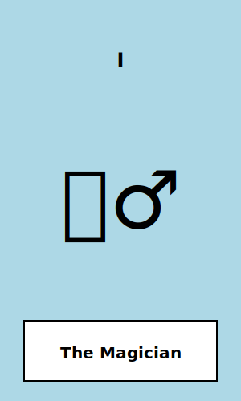
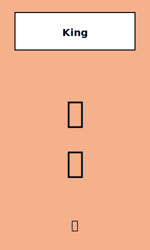

# TypeScript Tarot Cards

A comprehensive TypeScript library for modeling and working with a tarot deck, featuring a robust type system, flexible card selection strategies, and advanced spread modeling capabilities. By default the card descriptions conform to those of the [Rider-Waite-Smith Tarot](https://en.wikipedia.org/wiki/Rider%E2%80%93Waite%E2%80%93Smith_tarot) deck, but these can be overridden.

## Core Architecture & Philosophy

This library is built on several key architectural principles that make it both powerful and extensible:

### Unified Type System
- **Base Card Model**: All tarot cards inherit from `BaseTarotCard` with unified `numericValue` and `arcana` properties
- **Proper Numeric Values**: Major Arcana (0-21), Minor Arcana (1-14) with clear numeric progression
- **Type Safety**: Clean union types eliminate confusion from optional fields
- **Extensibility**: Easy to extend from archetype examples to full 78-card deck

### Flexible Reading Configuration
- **Use of Reversals based on reader preferences**: Configure at reader or spread level, with per-reading overrides
- **User Context Integration**: Support for reader questions like "what area of life to explore"
- **Comprehensive Interpretation System**: Both individual card meanings and overall spread analysis
- **Visual Representation**: Programmatic spread layouts using Graphviz DOT notation

### Generalizable Card Selection
- **Strategy Pattern**: Multiple selection methods (deal, fanpick) with unified interface
- **Hierarchical Configuration**: Default → Spread Preferred → Call Override
- **Extensible**: Easy to add new selection strategies

## Features

- **Enhanced Type System**: Complete type definitions with proper numeric associations and clean union types
- **Suit Properties**: Element associations and meanings for each suit (Cups/Water, Pentacles/Earth, Swords/Air, Wands/Fire)
- **Extensible Card System**: Archetype examples for major and minor arcana, designed to be extended to full 78-card deck and beyond
- **Advanced Deck Logic**: Shuffling, dealing, and fan pick functionality with biometric randomness integration
- **Sophisticated Spread Modeling**: Pre-defined spreads with visual representations, reversal control, and preferred strategies
- **Comprehensive Reading Support**: Complete reading workflow with card positions, interpretations, and user context
- **Flexible Card Selection**: Multiple strategies with hierarchical configuration

## Installation

```bash
npm install ts-tarot-cards
```

## Usage

### Basic Deck Operations

```typescript
import { TarotDeck } from 'ts-tarot-cards';

// Create and shuffle a deck
const deck = new TarotDeck();

// Select cards using the default strategy (deal from top)
const dealtCards = deck.selectCards(3);

// Select cards with specific options (fan pick with no reversals)
const fanPicked = deck.selectCards(1, { 
  strategy: CARD_SELECTION_STRATEGIES.fanpick 
});

// Check remaining cards
console.log(`${deck.getRemainingCount()} cards remaining`);

// Reset deck
deck.reset();
```

### Card Selection Strategies

The library supports multiple card selection methods through a flexible strategy pattern:

```typescript
import { TarotDeck, CARD_SELECTION_STRATEGIES, SHUFFLE_STRATEGIES } from 'ts-tarot-cards';

// Initialize deck with default strategy (deal)
const defaultDeck = new TarotDeck();

// Initialize deck with a specific strategy
const fanPickDeck = new TarotDeck(CARD_SELECTION_STRATEGIES.fanpick);

// Use the deck's default strategy
const cards1 = defaultDeck.selectCards(3); // Uses deal strategy

// Override with a specific strategy for this selection
const cards2 = defaultDeck.selectCards(3, { 
  strategy: CARD_SELECTION_STRATEGIES.fanpick 
});

// Change default card selection strategy
defaultDeck.setDefaultCardSelectionStrategy(CARD_SELECTION_STRATEGIES.deal);

// Shuffle the deck manually using default shuffle strategy
defaultDeck.shuffle();

// Shuffle with a specific shuffle strategy
defaultDeck.shuffle(SHUFFLE_STRATEGIES.riffle);

// Change default shuffle strategy
defaultDeck.setDefaultShuffleStrategy(SHUFFLE_STRATEGIES.fisherYates);

// Reset and shuffle the deck
defaultDeck.reset();

// Get available card selection strategies
const selectionStrategies = defaultDeck.getAvailableCardSelectionStrategies();
console.log(Object.keys(selectionStrategies)); // ['deal', 'fanpick']

// Get available shuffle strategies
const shuffleStrategies = defaultDeck.getAvailableShuffleStrategies();
console.log(Object.keys(shuffleStrategies)); // ['fisherYates', 'riffle']
```

**Available Card Selection Strategies:**
- **`deal`**: Sequential dealing from the top of the shuffled deck (traditional)
- **`fanpick`**: Random selection from fanned cards (intuitive selection)

**Available Shuffle Strategies:**
- **`fisherYates`**: Traditional Fisher-Yates shuffle algorithm for random distribution
- **`riffle`**: Simulates physical riffle shuffling with multiple passes

**Card Selection Strategy Priority:**
1. Explicit strategy parameter (highest priority)
2. Spread's preferred strategy
3. Deck's default strategy (lowest priority)

### Reversal Logic

Reversals are handled at the SpreadReader and Spread level, to reflect the real world modeling of how some tarot card readers choose to use reversals and others do not.

```typescript
import { SpreadReader, SPREADS, SPREAD_NAMES } from 'ts-tarot-cards';

const reader = new SpreadReader();

// Reversals are determined by the spread's allowReversals setting
const reading = reader.performReading(SPREAD_NAMES.threeCard); // Uses spread's reversal setting
console.log(reading.allowReversals); // true (from spread definition)

// Individual card positions show if they're reversed
reading.cards.forEach(cardPosition => {
  console.log(`${cardPosition.card.getName()}: ${cardPosition.isReversed ? 'Reversed' : 'Upright'}`);
});

// Create custom spread with specific reversal setting
const customSpread = reader.createCustomSpread(
  'Simple Guidance',
  'A single card for quick guidance',
  [{ position: 1, name: 'Guidance', positionSignificance: 'What you need to know', dealOrder: 1 }],
  false // No reversals for this spread
);

const simpleReading = reader.performCustomReading(customSpread);
console.log(simpleReading.allowReversals); // false
```

**Reversal Architecture:**
- **Deck level**: Card selection strategies return cards in upright position
- **Reader level**: SpreadReader applies reversal logic based on spread settings
- **Spread level**: Each spread defines whether it allows reversals
- **Position level**: Individual card positions track their reversed state

### Performing Spreads

```typescript
import { SpreadReader, SPREADS, CARD_SELECTION_STRATEGIES } from 'ts-tarot-cards';

const reader = new SpreadReader();

// Using available spread keys
const spreadKeys = Object.keys(SPREADS); // ['threeCard', 'crossSpread', 'simplePastPresent']
const strategyKeys = Object.keys(CARD_SELECTION_STRATEGIES); // ['deal', 'fanpick']

// Three-card spread (uses preferred strategy: 'deal')
const threeCardReading = reader.performReading(spreadKeys[0]); // 'threeCard'
console.log('Past:', threeCardReading.cards[0]);
console.log('Present:', threeCardReading.cards[1]);
console.log('Future:', threeCardReading.cards[2]);

// Cross spread (uses preferred strategy: 'fanpick')
const crossReading = reader.performReading(spreadKeys[1]); // 'crossSpread'

// Override spread's preferred strategy
const dealReading = reader.performReading(spreadKeys[1], strategyKeys[0]); // 'deal'
const fanpickReading = reader.performReading(spreadKeys[0], strategyKeys[1]); // 'fanpick'

// Custom strategy selection  
const customReading = reader.performReading(spreadKeys[0], 'fanpick');

// Custom spread with preferred strategy
const customSpread = reader.createCustomSpread(
  'Relationship Spread',
  'Insight into relationship dynamics',
  [
    { position: 1, name: 'You', meaning: 'Your role in the relationship', dealOrder: 1 },
    { position: 2, name: 'Partner', meaning: 'Their role in the relationship', dealOrder: 2 },
    { position: 3, name: 'Relationship', meaning: 'The relationship itself', dealOrder: 3 }
  ],
  true, // allow reversals
  undefined, // no visual representation
  strategyKeys[1] // 'fanpick' preferred strategy
);

const customReading = reader.performCustomReading(customSpread);
```

### Enhanced Reading Features

The library provides comprehensive reading support with user context and interpretations:

```typescript
// Reading with user context
const reading = reader.performReading(spreadKeys[0], strategyKeys[1], 'Career guidance for the next year');

// Generate interpretations
const interpretations = reader.generateInterpretations(reading);

// Access reading properties
console.log(reading.userContext); // "Career guidance for the next year"
console.log(reading.allowReversals); // true/false based on spread and override
console.log(reading.overallInterpretation); // Holistic reading summary (if provided)

// Individual card interpretations
interpretations.forEach(cardInterpretation => {
  console.log(`Position: ${cardInterpretation.position.name}`);
  console.log(`Significance: ${cardInterpretation.position.positionSignificance}`);
  console.log(`Card: ${cardInterpretation.card.name}`);
  console.log(`Meaning: ${cardInterpretation.meaning}`);
  console.log(`Reversed: ${cardInterpretation.isReversed}`);
});
```

### Working with Suits

```typescript
import { getSuitProperties, Suit, Element } from 'ts-tarot-cards';

const cupsProperties = getSuitProperties(Suit.Cups);
console.log(cupsProperties.element); // Element.Water
console.log(cupsProperties.generalMeaning); // "Emotions, relationships, spirituality, intuition"
```

### Card Information

```typescript
import { getMajorArcanaCard, MajorArcana } from 'ts-tarot-cards';

const fool = getMajorArcanaCard(MajorArcana.TheFool);
if (fool) {
  console.log(fool.uprightMeanings);
  console.log(fool.reversedMeanings);
  console.log(fool.keywords);
  console.log(fool.visualDescription); // Traditional Rider-Waite-Smith imagery
  console.log(fool.symbols); // ['cliff', 'sun', 'dog', 'mountains', 'bag', 'youth']
  console.log(fool.significance); // Journey context
}
```

### Card Symbols

Each card includes a hierarchical symbol structure for detailed visual analysis:

```typescript
// Symbols are freeform strings that can represent visual elements
const symbols = fool.symbols; // ['cliff', 'sun', 'dog', 'mountains', 'bag', 'youth']

// Symbols can be hierarchical (e.g., 'bird', 'dove', 'bird:dove')
// This allows for flexible categorization and filtering
const aceOfCups = getMinorArcanaCard(MinorArcana.AceOfCups);
console.log(aceOfCups.symbols); // ['hand', 'cloud', 'chalice', 'water', 'dove', 'communion wafer', 'lotus']

// Symbols enable advanced card analysis and cross-referencing
const allCards = [...Object.values(MAJOR_ARCANA_CARDS), ...Object.values(MINOR_ARCANA_CARDS)];
const waterSymbols = allCards.filter(card => 
  card && card.symbols.some(symbol => symbol.includes('water'))
);
```

**Symbol Structure Benefits:**
- **Visual Analysis**: Identify common themes across cards
- **Cross-referencing**: Find cards sharing visual elements
- **Study Aid**: Track symbolic evolution through spreads
- **Flexible Hierarchy**: Support both specific ('dove') and general ('bird') categorization

### SVG Representations

Each card has a `getSvg()` method that returns an SVG XML representation of the card. This can be used to display the cards in a web interface or other graphical application.

**Example:**
```typescript
import { getMajorArcanaCard, MajorArcana } from 'ts-tarot-cards';

const magician = getMajorArcanaCard(MajorArcana.TheMagician);
if (magician) {
  const svg = magician.getSvg();
  // svg contains the SVG XML string
}
```

**Sample SVGs:**

<table>
  <tr>
    <td>The Magician</td>
    <td>Eight of Cups</td>
    <td>King of Wands</td>
  </tr>
  <tr>
    <td></td>
    <td></td>
    <td></td>
  </tr>
</table>

### Emoji Representations

This library includes emoji representations for each card, making it suitable for text-based interfaces.

**Major Arcana Emojis:**

| Card Name          | Emoji      |
| ------------------ | ---------- |
| The Fool           | [M0🤡]     |
| The Magician       | [M1🧙‍♂️]    |
| The High Priestess | [M2🔮]     |
| The Empress        | [M3👸]     |
| The Emperor        | [M4🤴]     |
| The Hierophant     | [M5👏]     |
| The Lovers         | [M6👩‍❤️‍👨] |
| The Chariot        | [M7🏎️]    |
| Strength           | [M8🦁]     |
| The Hermit         | [M9🐚]     |
| Wheel of Fortune   | [M10🎡]    |
| Justice            | [M11⚖️]    |
| The Hanged Man     | [M12🙃]    |
| Death              | [M13💀]    |
| Temperance         | [M14🥂]    |
| The Devil          | [M15😈]    |
| The Tower          | [M16🗼]    |
| The Star           | [M17🌟]    |
| The Moon           | [M18🌙]    |
| The Sun            | [M19☀️]    |
| Judgement          | [M20🎺]    |
| The World          | [M21🌎]    |

**Minor Arcana Emojis:**

| Suit      | Ace    | ... | Page   | Knight | Queen  | King   |
| --------- | ------ | --- | ------ | ------ | ------ | ------ |
| Cups      | [mA🍵]  | ... | [m📜🍵]  | [m♞🍵]  | [m👸🏼🍵]  | [m🤴🏼🍵]  |
| Pentacles | [mA🪙]  | ... | [m📜🪙]  | [m♞🪙]  | [m👸🏾🪙]  | [m🤴🏾🪙]  |
| Swords    | [mA🗡️] | ... | [m📜🗡️] | [m♞🗡️] | [m👸🏻🗡️] | [m🤴🏻🗡️] |
| Wands     | [mA🪄]  | ... | [m📜🪄]  | [m♞🪄]  | [m👸🏽🪄]  | [m🤴🏽🪄]  |

## Current Card Set

This library now includes the full 78-card Rider-Waite-Smith deck.

**Major Arcana (22 cards)**:
- All 22 cards from The Fool to The World.

**Minor Arcana (56 cards)**:
- All 14 cards for each of the four suits: Cups, Pentacles, Swords, and Wands.

## Types

### Core Types

- `TarotCard`: Complete card definition with meanings, keywords, and metadata
- `CardPosition`: Card with position and reversal information
- `Spread`: Spread definition with positions and meanings
- `SpreadReading`: Complete reading with cards, spread, and timestamp

### Enums

- `Arcana`: Major, Minor
- `Suit`: Cups, Pentacles, Swords, Wands
- `Element`: Water, Earth, Air, Fire
- `MinorNumber`: Ace through King
- `MajorArcana`: All 22 major arcana cards

## Development

```bash
# Install dependencies
npm install

# Build the library
npm run build

# Run tests
npm test

# Development mode (watch)
npm run dev
```

## Architecture Notes

- **Biometric Randomness**: The shuffling system includes stubs for integrating biometric randomness sources (heart rate variability, mouse movements, etc.) for enhanced randomness in divination contexts
- **Extensibility**: The card system is designed to easily accommodate the full 78-card deck
- **Type Safety**: Full TypeScript typing ensures compile-time validation of card operations

## IMPORTANT DISCLAIMER

⚠️ **This library is for educational, entertainment, and software development purposes only.**

- Tarot card interpretations provided in this library are traditional meanings and should not be considered as professional advice
- Some interpretations included are the author's own and may vary from other sources or traditions  
- This software is not intended to provide medical, psychological, financial, or legal guidance
- Any decisions made based on tarot readings should not replace professional consultation
- The developers are not responsible for any decisions made using this library
- Card meanings and interpretations may vary among different traditions and practitioners
- Random number generation, even with biometric enhancement, cannot predict future events

Use responsibly and with an understanding that tarot is a tool for reflection and entertainment, not prediction or professional guidance.

## Upcoming Feature Roadmap

This library is designed to be extensible and support multiple tarot traditions. Future enhancements include:

### Alternative Tarot Deck Support
- **[Thoth Tarot](https://en.wikipedia.org/wiki/Thoth_tarot_deck)**: Aleister Crowley's esoteric deck with unique interpretations and imagery
- **[Marseille Tarot](https://en.wikipedia.org/wiki/Tarot_of_Marseilles)**: Traditional French tarot with historical significance
- **[Visconti-Sforza Tarot](https://en.wikipedia.org/wiki/Visconti-Sforza_tarot_deck)**: Renaissance-era deck with artistic and historical importance

### Extended Functionality
- **Multi-Language Support**: Localization for card names and interpretations
- **Enhanced Biometric Randomness**: Integration with various entropy sources
- **Advanced Spread Builder**: Visual spread editor and custom position creation
- **Reading History**: Persistent storage and analysis of past readings

## License

ISC

## Contributing

Contributions are welcome! Please feel free to submit pull requests to expand the card database, add new spread types, or improve functionality.
